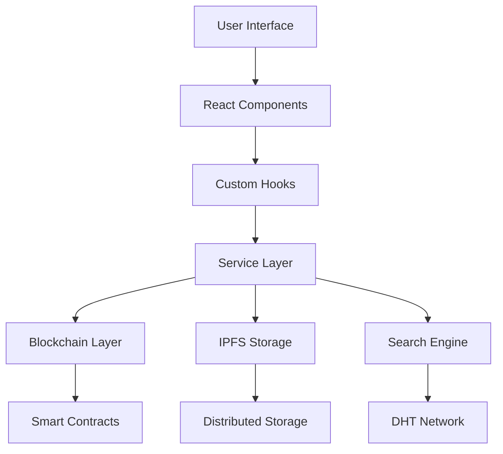

# OmniBazaar Marketplace Development Plan & Roadmap

## Overview

This document outlines the comprehensive development plan for implementing the OmniBazaar marketplace module in our unified browser extension. The plan is based on the analysis of the legacy OmniCoin-v1--UI application and aims to recreate all existing functionality while modernizing the technology stack and integrating with our new modular architecture.

## Legacy Application Analysis

### Current Legacy Features

Based on analysis of `OmniCoin-v1--UI`, the legacy application includes:

#### Core Navigation Structure
- **Wallet Management** - Multi-currency wallet support (OmniCoin, Bitcoin, Ethereum)
- **Marketplace** - Full-featured decentralized marketplace
- **Transfer/Payments** - P2P payment system
- **Exchange** - Token sale and trading functionality
- **Escrow (SecureSend)** - Payment protection service
- **Processors** - Community policing and reputation system
- **Mail System** - Decentralized messaging
- **Support** - Help and documentation
- **Settings & Preferences** - User customization
- **Identity Verification** - KYC/AML compliance

#### Marketplace Features
1. **Category System**
   - **For Sale**: Antiques, Appliances, Arts/Crafts, Baby/Child, Barter, Beauty/Health, Bikes, Boats, Books, Business, Cars/Trucks, CD/DVD/VHS, Farm/Garden, Free, Furniture, Garage Sale, General, Heavy Equipment, Household, Jewelry, Materials, Motorcycles, Musical Instruments, NSFW, Photo/Video, RVs/Campers
   - **Services**: Automotive, Beauty/Personal, Computer/IT, Creative, Dental, Event Management, Farm/Garden, Financial, Healthcare, Labor/Construction, Legal, Lessons/Coaching, Marine, Real Estate, Skilled Trades, Small Business, Therapeutic, Travel/Vacation, Writing/Editing
   - **Jobs**: Accounting/Finance, Admin/Office, Architect/Engineer, Art/Media/Design, Aerospace/Science, Business Management, Customer Service, Education, Food/Beverage/Hospitality, General Labor, Government, Human Resources, IT/Software/Computer, Legal/Paralegal, Manufacturing, Sales/Marketing
   - **CryptoBazaar**: Local+OmniCoin, Local+Bitcoin, Local+Ethereum, Local+Monero, Local+Other, OmniCoin+Bitcoin, OmniCoin+Ethereum, OmniCoin+Other

2. **Listing Management**
   - Create/Edit listings with rich media support
   - My Listings dashboard
   - Listing defaults and templates
   - Import/Export functionality
   - Favorites system
   - Featured listings with priority fees

3. **Search & Discovery**
   - Advanced search with filters
   - Search results with sorting
   - Recent searches history
   - Saved searches
   - Search priority system based on publisher criteria
   - Location-based filtering

4. **Transaction Features**
   - Purchase management
   - Order tracking
   - Payment integration
   - Shipping management

#### Escrow (SecureSend) Features
- **Escrow Transactions** - View and manage all escrow transactions
- **Escrow Agents** - Manage trusted third-party agents
- **Escrow Settings** - Configure escrow preferences
- **Escrow Proposals** - Handle dispute resolution

#### Community Features
- **Processors System** - Active and standby processors for community governance
- **Reputation System** - User rating and feedback
- **Community Policing** - Decentralized moderation
- **Mail System** - Secure messaging between users

## Technology Migration Plan

### Current Stack (Legacy)
- React 16.2 with Redux
- Electron (Desktop app)
- Semantic UI React
- Redux Saga
- React Router
- React Intl (i18n)
- SCSS styling

### Target Stack (New Browser Extension)
- React 18 with TypeScript
- Browser Extension (Chrome/Firefox)
- Styled Components / Chakra UI
- React Query / SWR
- React Router v6
- React Intl (maintained)
- Modern CSS-in-JS

## Development Phases

### Phase 1: Foundation & Architecture (Weeks 1-2)

#### 1.1 Project Structure Setup
- [ ] Set up TypeScript configuration
- [ ] Configure build system for browser extension
- [ ] Set up testing framework (Jest + React Testing Library)
- [ ] Configure ESLint and Prettier
- [ ] Set up Storybook for component development

#### 1.2 Core Infrastructure
- [ ] **Theme System**
  - Migrate existing color scheme and typography
  - Create unified design tokens
  - Implement dark/light mode support
  - Ensure consistency with Wallet module

- [ ] **Internationalization**
  - Set up React Intl
  - Extract all message strings from legacy code
  - Create translation infrastructure
  - Support for multiple languages

- [ ] **State Management**
  - Set up Redux Toolkit or Zustand
  - Define core state structure
  - Implement persistence layer
  - Create typed actions and selectors

#### 1.3 Integration Layer
- [ ] **Wallet Module Integration**
  - Payment processing
  - Transaction signing
  - Balance management
  - Multi-currency support

- [ ] **Storage Module Integration**
  - IPFS listing storage
  - Image upload/retrieval
  - Metadata management
  - Distributed storage

- [ ] **DEX Module Integration**
  - Token swapping
  - Price feeds
  - Liquidity pools
  - Trading functionality

### Phase 2: Core Marketplace Components (Weeks 3-5) ✅ COMPLETED

#### 2.1 Navigation & Layout ✅ COMPLETED
- [x] **Main Navigation**
  - [x] Header navigation with OmniBazaar branding
  - [x] Navigation between Wallet and Bazaar modules
  - [x] Responsive design implementation
  - [x] Mobile-optimized layouts

- [x] **Layout Components**
  - [x] Page containers with proper spacing
  - [x] Content wrapper components
  - [x] Gradient background system
  - [x] Professional styling and animations

#### 2.2 Category System ✅ COMPLETED
- [x] **Category Management**
  - [x] Four main categories: For Sale, Services, Jobs, CryptoBazaar
  - [x] Category selection interface
  - [x] Subcategory tagging system
  - [x] Category-specific styling and colors

- [x] **Category Components**
  - [x] CategoryGrid component with interactive cards
  - [x] Category icons and descriptions
  - [x] Statistics display (listing counts, status)
  - [x] Quick action buttons

#### 2.3 Listing System ✅ COMPLETED
- [x] **Listing Display**
  - [x] Listing card component (existing)
  - [x] Professional listing detail mockup
  - [x] Image gallery design
  - [x] Responsive grid layouts

- [x] **Listing Creation/Editing**
  - [x] CreateListingDialog component (TypeScript issues resolved)
  - [x] Professional create listing page mockup
  - [x] Image upload interface design
  - [x] Multi-step form with validation
  - [x] Crypto pricing integration

#### 2.4 UI Mockups & Design ✅ COMPLETED
- [x] **Professional HTML Mockups**
  - [x] marketplace-categories.html - Category selection interface
  - [x] listing-detail.html - Individual listing view with SecureSend
  - [x] create-listing.html - Comprehensive listing creation form
  - [x] Updated index.html with new marketplace pages

- [x] **Inter-Module Integration**
  - [x] Updated Wallet/Images gallery navigation
  - [x] Consistent design language across modules
  - [x] Professional Material Design implementation

### Phase 3: Search & Discovery (Weeks 6-7) ✅ COMPLETED

#### 3.1 Search Infrastructure ✅ COMPLETED
- [x] **Search Components**
  - [x] SearchBar.tsx - Search bar with autocomplete and suggestions
  - [x] SearchFilters.tsx - Advanced filters panel with all options
  - [x] SearchResultsPage.tsx - Sort options and results display
  - [x] Results pagination (responsive grid layout ready)

- [x] **Search Features**
  - [x] Text search with indexing (mock implementation)
  - [x] Category filtering (For Sale, Services, Jobs, CryptoBazaar)
  - [x] Price range filtering (min/max price with currency)
  - [x] Location-based search (city, state, country)
  - [x] Date/relevance sorting (newest, price, rating, popularity)

#### 3.2 Search Management ✅ COMPLETED
- [x] **Search History**
  - [x] Recent searches storage (localStorage integration ready)
  - [x] Saved searches management (state management implemented)
  - [x] Search suggestions (iPhone, MacBook, services examples)
  - [x] Quick filters (type and category quick selection)

#### 3.3 UI Mockups ✅ COMPLETED  
- [x] **search-results.html** - Professional HTML mockup with filters and results
- [x] **Cross-navigation** - Updated index.html with search page
- [x] **Responsive Design** - Mobile-first approach with breakpoints
- [x] **Professional Styling** - Material Design with gradient backgrounds

#### 3.4 Advanced Features (Phase 4)
- [ ] **Search Priority**
  - [ ] Publisher criteria system
  - [ ] Priority fee management
  - [ ] Featured listings promotion
  - [ ] Search result ranking

### Phase 4: Transaction Management (Weeks 8-9)

#### 4.1 Purchase Flow
- [ ] **Purchase Components**
  - Buy now buttons
  - Quantity selection
  - Price calculation
  - Shipping selection

- [ ] **Order Management**
  - Order creation
  - Order tracking
  - Order history
  - Status updates

#### 4.2 My Purchases
- [ ] **Purchase Dashboard**
  - Active orders
  - Order history
  - Tracking information
  - Return/refund requests

### Phase 5: SecureSend (Escrow) System (Weeks 10-11)

#### 5.1 Escrow Infrastructure
- [ ] **Smart Contract Integration**
  - Escrow contract deployment
  - Multi-signature support
  - Automated release mechanisms
  - Dispute resolution

#### 5.2 Escrow Components
- [ ] **Escrow Transactions**
  - Transaction creation
  - Status tracking
  - Release/refund actions
  - Transaction history

- [ ] **Escrow Agents**
  - Agent selection
  - Agent profiles
  - Rating system
  - Agent management

- [ ] **Escrow Settings**
  - Default escrow preferences
  - Auto-release settings
  - Notification preferences
  - Fee configuration

### Phase 6: Community Features (Weeks 12-13)

#### 6.1 User Reputation
- [ ] **Reputation System**
  - User rating calculation
  - Feedback collection
  - Reputation display
  - Trust indicators

#### 6.2 Community Policing
- [ ] **Processors System**
  - Active processors list
  - Standby processors
  - Voting mechanisms
  - Governance participation

- [ ] **Moderation Tools**
  - Report functionality
  - Content flagging
  - Community voting
  - Automated moderation

### Phase 7: Advanced Features (Weeks 14-15)

#### 7.1 Listing Management
- [ ] **My Listings Dashboard**
  - Listing grid/list views
  - Bulk operations
  - Performance analytics
  - Revenue tracking

- [ ] **Listing Defaults**
  - Template system
  - Default settings
  - Bulk editing
  - Import/export tools

#### 7.2 Favorites & Recommendations
- [ ] **Favorites System**
  - Save/unsave listings
  - Favorites dashboard
  - Price alerts
  - Availability notifications

- [ ] **Recommendation Engine**
  - Based on viewing history
  - Category preferences
  - Location-based suggestions
  - Trending items

### Phase 8: Integration & Testing (Weeks 16-17)

#### 8.1 Module Integration
- [ ] **Cross-Module Communication**
  - Event system between modules
  - Shared state management
  - Consistent user experience
  - Data synchronization

#### 8.2 Testing & Quality Assurance
- [ ] **Comprehensive Testing**
  - Unit tests for all components
  - Integration tests for workflows
  - E2E tests for critical paths
  - Performance testing

### Phase 9: Polish & Launch (Weeks 18-19)

#### 9.1 UI/UX Polish
- [ ] **Design Refinement**
  - Consistent styling
  - Smooth animations
  - Loading states
  - Error handling

#### 9.2 Performance Optimization
- [ ] **Optimization**
  - Code splitting
  - Lazy loading
  - Bundle optimization
  - Caching strategies

## Technical Architecture

### Component Structure

```text
src/
├── components/
│   ├── marketplace/
│   │   ├── MarketplaceHeader/
│   │   ├── Navigation/
│   │   ├── CategoryGrid/
│   │   ├── ListingCard/
│   │   ├── SearchBar/
│   │   └── Filters/
│   ├── listings/
│   │   ├── CreateListing/
│   │   ├── EditListing/
│   │   ├── ListingDetail/
│   │   ├── ListingGallery/
│   │   └── MyListings/
│   ├── escrow/
│   │   ├── EscrowDashboard/
│   │   ├── CreateEscrow/
│   │   ├── EscrowAgents/
│   │   └── EscrowSettings/
│   ├── search/
│   │   ├── SearchResults/
│   │   ├── SearchFilters/
│   │   ├── SavedSearches/
│   │   └── SearchHistory/
│   └── community/
│       ├── Processors/
│       ├── Reputation/
│       └── UserProfile/
├── pages/
│   ├── MarketplacePage/
│   ├── CategoryPage/
│   ├── ListingDetailPage/
│   ├── SearchResultsPage/
│   ├── MyListingsPage/
│   └── EscrowPage/
├── hooks/
│   ├── useMarketplace/
│   ├── useListings/
│   ├── useEscrow/
│   ├── useSearch/
│   └── useReputation/
├── services/
│   ├── api/
│   ├── blockchain/
│   ├── storage/
│   └── search/
└── types/
    ├── marketplace.ts
    ├── listing.ts
    ├── escrow.ts
    └── user.ts
```

### Smart Contract Integration

#### Required Contracts
1. **ListingNFT.sol** - NFT-based listing representation
2. **SecureSend.sol** - Escrow contract for secure transactions
3. **Reputation.sol** - User reputation management
4. **Marketplace.sol** - Core marketplace functionality

#### Integration Points
- Wallet module for transaction signing
- Storage module for IPFS integration
- DEX module for token swapping

### Data Flow Architecture



## Integration Requirements

### Wallet Module Integration
- **Payment Processing**: Handle OmniCoin, Bitcoin, Ethereum payments
- **Transaction Signing**: Secure transaction approval flow
- **Balance Management**: Real-time balance updates
- **Multi-Currency Support**: Support for all integrated cryptocurrencies

### Storage Module Integration
- **Listing Data**: Store listing metadata on IPFS
- **Image Storage**: Efficient image upload and retrieval
- **Search Indexing**: Maintain searchable listing database
- **Data Persistence**: Local caching and synchronization

### DEX Module Integration
- **Token Exchange**: Enable crypto-to-crypto trading
- **Price Feeds**: Real-time cryptocurrency prices
- **Liquidity**: Access to decentralized liquidity pools
- **Cross-Chain**: Support for multi-chain transactions

## Quality Assurance

### Testing Strategy
1. **Unit Tests**: All components and utilities (90%+ coverage)
2. **Integration Tests**: Module interaction testing
3. **E2E Tests**: Critical user journeys
4. **Performance Tests**: Load and stress testing
5. **Security Tests**: Smart contract audits and penetration testing

### Code Quality
- TypeScript strict mode
- ESLint with custom rules
- Prettier code formatting
- Husky pre-commit hooks
- Automated code review

## Security Considerations

### Smart Contract Security
- Multi-signature escrow mechanisms
- Time-locked transactions
- Dispute resolution protocols
- Emergency pause functionality

### User Data Protection
- End-to-end encryption for messages
- Zero-knowledge proofs for privacy
- Minimal data collection
- GDPR compliance

### Platform Security
- Content moderation systems
- Anti-fraud mechanisms
- Reputation-based trust
- Community governance

## Success Metrics

### User Experience
- **Performance**: <3s page load times
- **Usability**: <5 clicks to complete common tasks
- **Accessibility**: WCAG 2.1 AA compliance
- **Mobile**: Responsive design for all screen sizes

### Business Metrics
- **Adoption**: User registration and retention rates
- **Engagement**: Daily/monthly active users
- **Transactions**: Volume and success rates
- **Security**: Zero critical security incidents

## Maintenance & Evolution

### Ongoing Development
- Monthly feature releases
- Quarterly security reviews
- Annual architecture assessments
- Continuous performance monitoring

### Community Feedback
- User feedback collection
- Feature request tracking
- Community voting on improvements
- Developer ecosystem support

## Risk Mitigation

### Technical Risks
- **Blockchain Congestion**: Implement layer 2 solutions
- **IPFS Availability**: Multiple gateway redundancy
- **Security Vulnerabilities**: Regular audits and bug bounties
- **Performance Issues**: Continuous monitoring and optimization

### Business Risks
- **Regulatory Changes**: Modular compliance framework
- **Market Competition**: Rapid feature development
- **User Adoption**: Comprehensive onboarding and support
- **Network Effects**: Community incentive programs

## Conclusion

This development plan provides a comprehensive roadmap for recreating and enhancing the OmniBazaar marketplace functionality within our unified browser extension architecture. The 19-week timeline balances feature completeness with quality delivery, ensuring all legacy functionality is preserved while modernizing the technology stack and improving user experience.

The modular approach enables parallel development across teams and ensures seamless integration with the Wallet, Storage, and DEX modules. Regular milestones and testing phases guarantee high-quality delivery and minimize risks.

Success depends on maintaining close coordination between all module teams, adhering to established coding standards, and continuously gathering user feedback to guide development priorities.